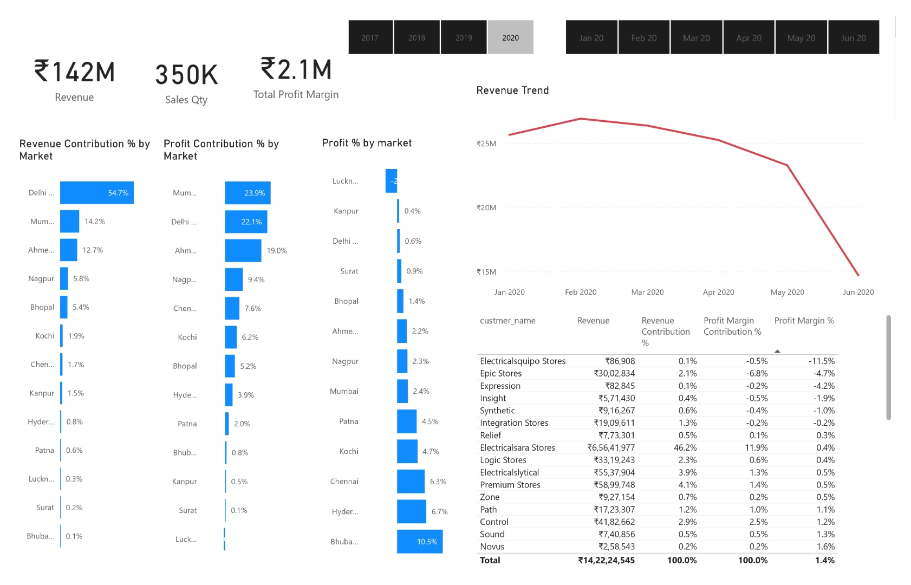
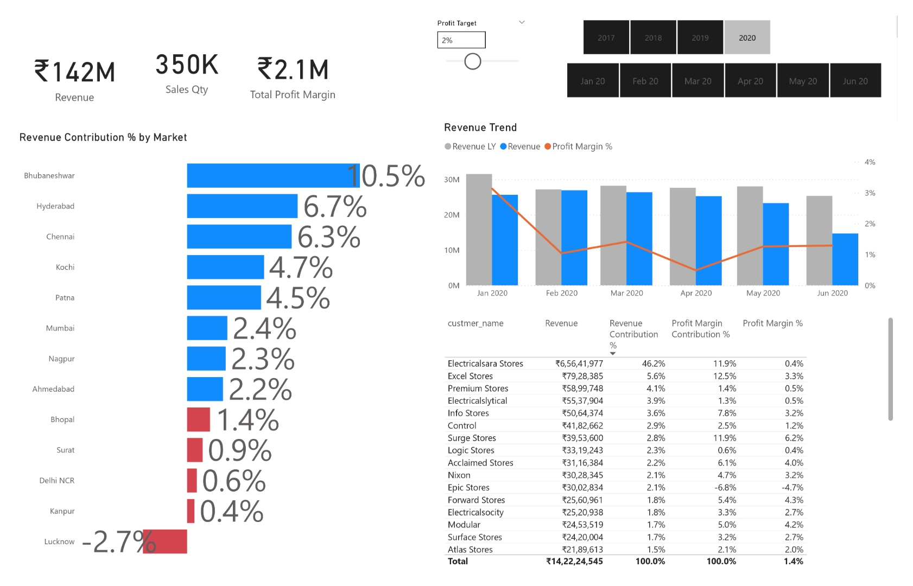

# 📊 Sales Insights Dashboard

> End-to-end sales analytics project for a computer hardware distributor operating across 14 Indian markets. Replaces manual verbal reporting with an automated **Power BI dashboard** fed by a **MySQL database** and cleaned via a **Python ETL pipeline**.

[]()
[]()
[]()
[]()
[]()

---

## 📌 Problem Statement

The Sales Director of a mid-size hardware distribution company had **zero visibility** into actual sales performance. Regional managers delivered verbal summaries that were incomplete and inconsistent. This project replaced that manual process by building a centralised analytics layer:

```
MySQL Database → Python ETL → Cleaned CSV → Power BI Dashboard
```

The director can now self-serve insights by market, customer, product, and time period — filtered down to the month.

---

## 🗂️ Project Structure

```
sales-insights-dashboard/
├── README.md
├── sql/
│   ├── sales_analysis_queries.sql   ← 6-section EDA + transformation queries
│   └── README.md                    ← Table schemas + query index
├── python/
│   └── etl_pipeline.py              ← Full ETL: load → inspect → clean → validate → transform → export
├── data/
│   └── sales_sample.csv             ← 1,000-row anonymised sample (full dataset via Kaggle)
├── dashboard/
│   ├── overview.jpg                 ← Page 1: Revenue & KPI overview
│   ├── profit_analysis.jpg          ← Page 2: Profit % by market with target slicer
│   ├── performance_insights.jpg     ← Page 3: Revenue by market, Top 5 customers & products
│   └── README.md                    ← Dashboard pages + DAX measures
├── .gitignore
└── requirements.txt
```

---

## 🗄️ Data Model

MySQL database: `sales` — 5 tables

| Table | Key Columns |
|-------|-------------|
| `transactions` | `product_code`, `customer_code`, `market_code`, `order_date`, `sales_qty`, `sales_amount`, `currency`, `profit_margin_percentage`, `profit_margin`, `cost_price` |
| `customers` | `customer_code`, `custmer_name`, `customer_type` (Brick & Mortar / E-Commerce) |
| `markets` | `markets_code`, `markets_name`, `zone` (North / South / Central) |
| `products` | `product_code`, `product_type` (Own Brand / Distribution) |
| `date` | `date`, `cy_date`, `year`, `month_name`, `date_yy_mmm` |

---

## ⚙️ ETL / Data Cleaning

Cleaning performed in both **Python** (`python/etl_pipeline.py`) and **Power Query** inside Power BI.

| Step | Action | Impact |
|------|--------|---------|
| 1 | Strip `\r` carriage-return artifacts from `currency` field | Fixes `INR\r`, `USD\r` MySQL dump artifacts |
| 2 | Remove `sales_amount ≤ 0` rows | ~2% of raw records excluded |
| 3 | Exclude non-India markets (`Mark097` Paris, `Mark999` New York) | Scope correction |
| 4 | Currency normalisation: `USD × 75 → INR` → `norm_sales_amount` | Consistent comparison across markets |
| 5 | Exact deduplication | Removes duplicate rows from MySQL dump |
| 6 | Feature engineering | `year`, `month`, `quarter`, `ym`, `revenue_tier` columns added |

**Power Query M formula (used inside Power BI):**
```m
= Table.AddColumn(#"Filtered Rows", "norm_sales_amount",
    each if [currency] = "USD" or [currency] = "USD#(cr)"
    then [sales_amount] * 75
    else [sales_amount], type any)
```

---

## 📊 KPIs Tracked

| KPI | Description |
|-----|-------------|
| **Total Revenue** | `SUM(norm_sales_amount)` across valid transactions |
| **Total Sales Quantity** | `SUM(sales_qty)` |
| **Total Profit Margin** | `SUM(profit_margin)` normalised to INR |
| **Revenue Contribution % by Market** | Each market's share of total revenue |
| **Profit Contribution % by Market** | Each market's share of total profit |
| **Profit % by Market** | `profit_margin / sales_amount × 100` per market |
| **Revenue Trend (Monthly)** | Revenue + Revenue LY + Profit Margin % on a time axis |
| **Top 5 Customers** | By revenue contribution |
| **Top 5 Products** | By revenue contribution |

---

## 📊 Dashboard

### Page 1 — Revenue Overview

*KPI cards (Revenue, Sales Qty, Profit Margin) · Revenue & Profit Contribution % by Market · Profit % by Market · Monthly Revenue Trend*

### Page 2 — Profit Analysis

*Profit % by Market with dynamic Profit Target slicer · Revenue Trend overlaid with LY Revenue and Profit Margin % · Full customer-level table*

### Page 3 — Performance Insights

*Revenue by Market · Sales Qty by Market · Top 5 Customers · Top 5 Products*

> See [`dashboard/README.md`](dashboard/README.md) for full DAX measures used.

---

## 🔍 Key Findings

- **Delhi NCR** contributes ~54.7% of total revenue but has only a **0.6% profit margin** — high volume, dangerously thin margin
- **Bhubaneshwar** (10.5%) and **Hyderabad** (6.7%) are the most *profitable* markets despite lower absolute revenue
- **Lucknow** operates at a **negative −2.7% profit margin** — a loss-making market requiring urgent review
- **Electricalsara Stores** alone accounts for **46.2% of total revenue** (₹6.56 Cr) — single-customer dependency risk
- Revenue declined **~50% from Jan to Jun 2020** (₹30M → ₹15M/month) — likely COVID-19 disruption
- **E-Commerce customers** (e.g., Excel Stores at 12.5% margin) are significantly more profitable per rupee than Brick & Mortar

---

## 🚀 How to Reproduce

### 1 — MySQL Setup
```bash
# Download full dataset from Kaggle (link in data/README)
mysql -u root -p -e "CREATE DATABASE sales;"
mysql -u root -p sales < db_dump_version_2.sql
```

### 2 — Python ETL
```bash
pip install -r requirements.txt
python python/etl_pipeline.py
# Output: data/sales_cleaned.csv
```

### 3 — Power BI
1. Open Power BI Desktop
2. **Get Data → MySQL Database** → connect to `localhost/sales`
3. Load all five tables
4. Apply Power Query transformations (see ETL section above)
5. Recreate DAX measures documented in [`dashboard/README.md`](dashboard/README.md)

---

## 🛠️ Tech Stack

| Layer | Tool |
|-------|------|
| Storage | MySQL 8.0 |
| ETL (Python) | Python 3.11 · Pandas · NumPy |
| ETL (BI layer) | Power Query M language |
| Dashboard | Power BI Desktop |
| DAX Measures | Revenue, Profit Margin %, Revenue Contribution %, LY Revenue, YoY Δ |
| SQL Analysis | MySQL 8.0 (6 query sections: EDA, quality checks, revenue, profit, customer, product) |

---

## 📚 Dataset

- **Source:** [Sales Data Insights— Kaggle]([https://www.kaggle.com/datasets/](https://www.kaggle.com/code/abdunnoor11/sales-data-analysis/input))
- **Coverage:** June 2017 – June 2020
- **Raw size:** ~150,000 transaction rows
- **Sample:** `data/sales_sample.csv` — 1,000 anonymised rows included in this repo
- All figures are in INR unless otherwise noted.

---

## 👤 Author

**Harshil Nagwani** — [GitHub](https://github.com/harshilnagwani) · [LinkedIn](https://www.linkedin.com/in/harshilnagwani/)
